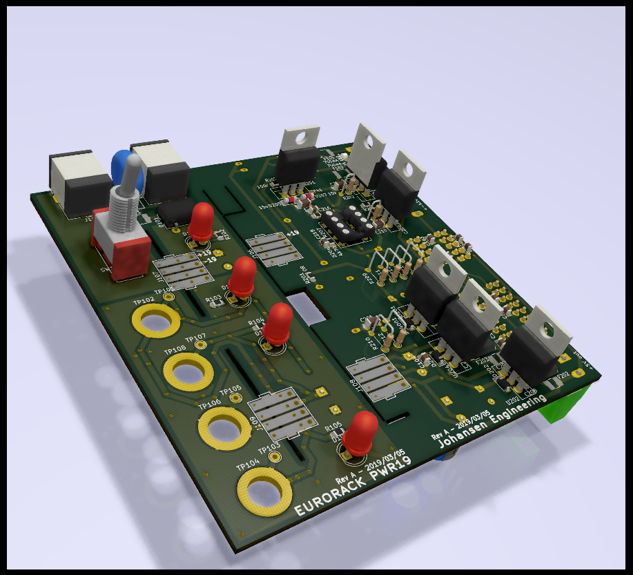
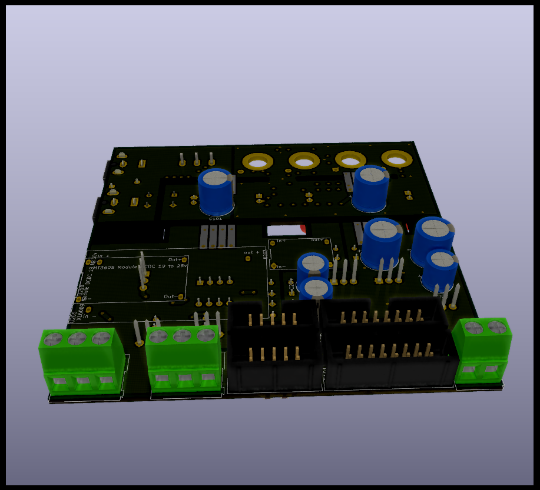

# KicadJE-EuroPowerSupply
Takes a Laptop 19V input and makes +-12 and 5 v out

# MK1 Design
## Status - PCB in the mail
## Initial 
| Stage  | Detail | Status |
| ------------- | ------------- | ------------- |
| create material  | sch/pcb | done  |
| | gerber | done |
| production  |   | Initiated |
|  | produced | Done |
|  | delivered | In the mail |
## Preliminary validation
| Test  | Detail | Status |
| ------------- | ------------- | ------------- |
| Initial Inspection |  |  |
| Initial Technical Test |   |  |
| Initial Product Test |   |  |

## Secondary validation
| Test  | Detail | Status |
| ------------- | ------------- |------------- |
| Product Test |  | |
| Quality |  | |
| Long Term Product Test | |  |

## Errata
## Issues and Notes
 * Note
### Workarounds

# Base Construction 
The idea is to have a laptop power supply provide the power for the synth, as they are powerful and inexpensive.

## Inputs
19v DC barrel jack.

## Outputs
### Front side
 - Banana +12v
 - Banana +5v
 - Banana GND
 - Banana -12v

### Back side
 - 10 pin doepfer connector
 - 16 pin doepfer connector
 - +/- 12v connector
 - +5 v connector

## Electrical
The input is fed to a DC-DC boost converter (to 30volts) and to a virtual GND circuit (making it +-15v) for the +-12v supply.
The +15v is sent to a step down converter (to 7volts) for the +5v supply.
The +-15 and +7 volt supplies are provided through common mode chokes to linear regulators.

## Regulation and noise 
### Input
No filtering on the input except for the overvoltage protection and  smoothing capacitor after the bridge rectifier.
### DCDC - Boost 30v
Directly on the DCDC output is made room for a Zener regulated NPN for 28 or 30v depending on the boost converter.
The 30v is sent to a Virtual GND that has smoothing capacitors on the input and output.
After the VGND room has been made for either small resistors (forming an RC filter) or a common mode choke for high frequency filtering.
Regulation is performed after the RC / LC filter with linear 7812 / 7912 regulators.

### DCDC - Buck 5v

### Safety / Protection
The 19v is fed through a bridge rectifier to protect the circuit and allow for both AC and DC with any polarity. The circuit is protected on the input by a polyfuse and a VDR afterwards in parallel with a Zener (or TVS) in series w a small resistor to protect from overcurrent, over voltage and spikes.
The linear regulators are fused with polyfuses

## Physical
The product is an 8HP module for the front of a Eurorack synth.
